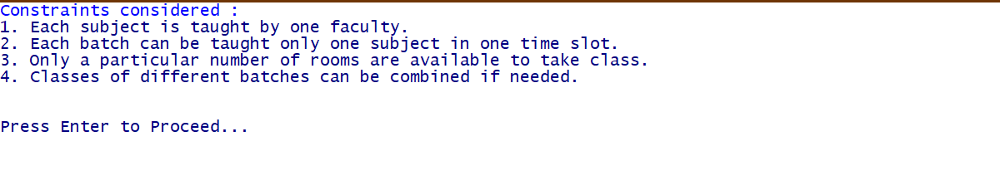
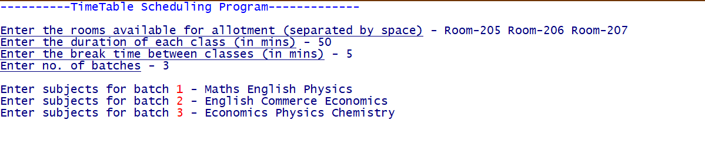
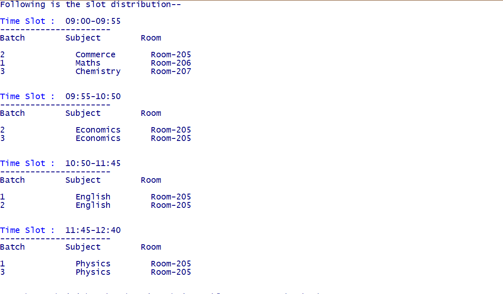

# Time-Table-Generator
<b>Time Table Generation System</b>
Constraints Taken:
<ul>
  <li>Each subject is taught by one faculty.</li>
  <li>Each batch can be taught only one subject in one time slot.</li>
  <li>Only a particular number of rooms are available to take class.</li>
  <li>Classes of different batches can be combined if needed.</li>
</ul>
 

